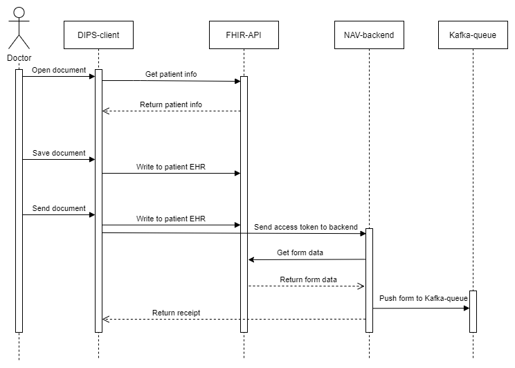

# Kundestyrt2020-NAV-DIPS


## Contents of this file
 * Introduction
 * Installation
 * SMART on FHIR 
 * Usage
 * Maintainers
 
## Introduction
This project is the work of group 9 in the class TDT4290 - Customer Driven Project at NTNU during the fall of 2020. The group was assigned NAV and DIPS as customers, who wanted to explore the possibilities and capabilities available through the use of the SMART on FHIR platform in developing a web-app.
The main goal of this project was to create a SMART-app, as a proof of concept for digitizing the process for a specific type of application (attendance allowance) within NAVs systems.  

## Installation

### Frontend
Download  and install **Node.js** and **npm** following [this installation guide](https://docs.npmjs.com/downloading-and-installing-node-js-and-npm).

Navigate to the `\frontend` folder, and install all necessary dependencies using the terminal with:
```bash
npm install
```
When all dependencies are installed the app can be started by running
 ```bash
npm start
```
### Back-end
The backendapplication has a kafkaproducer & -consumer. It connects to bootstrap-servers, as specified in application.properties.
To allow the kafkaproducer & -consumer to connect to NAVs kafka stream, we need to have a keystore and a truststore, as well as the respective passwords.
 - Ask the owner of this repository to send the keystore and clientstore, as well as the respective passwords.
 - From there on, there are two recommended ways to run the backend, to run it from the command line or to run in from Intellij.
   - <b>Intellij:</b>
     - [Download Intellij.](https://www.jetbrains.com/idea/download/)
     - Set the necessary environmentvariables for the keystore and truststore by:
       - double tap shift -> "Edit configurations..." -> "+" -> "Spring boot"
         - Set "Main class" to: com.ntnu.BackendApplication
         - Set "Environment variables" to:<br>CLIENT_KEYSTORE_LOCATION=<KEYSTORE_LOCATION>;CLIENT_KEYSTORE_PASSWORD=<KEYSTORE_PASSWORD>;CLIENT_TRUSTSTORE_LOCATION=<TRUSTSTORE_LOCATION>;CLIENT_TRUSTSTORE_PASSWORD=<TRUSTSTORE_PASSWORD>
       - Accept changes by clicking "OK"
     - Install dependencies: Right click on pom.xml -> "Maven" -> "Reload Project"
     - Run the application by pressing the green play button (Shift+F10).
   - <b>Command line:</b>
     - [Download the Kotlin compiler.](https://kotlinlang.org/docs/tutorials/command-line.html#downloading-the-compiler)
     - [Install Maven.](https://www.baeldung.com/install-maven-on-windows-linux-mac)
     - Run the application with:

       `sudo mvn spring-boot:run -Dspring-boot.run.arguments="--CLIENT_KEYSTORE_LOCATION=<KEYSTORE_LOCATION> --CLIENT_KEYSTORE_PASSWORD=<KEYSTORE_PASSWORD> --CLIENT_TRUSTSTORE_LOCATION=<TRUSTSTORE_LOCATION> --CLIENT_TRUSTSTORE_PASSWORD=<TRUSTSTORE_PASSWORD>"`
 - You can test that everything is working by using the [testing endpoint](http://localhost:8081/testing). It should display "Published successfully".
 
 
 
 - Store the clientstore and keystore on your computer and set the CLIENT_KEYSTORE_LOCATION and CLIENT_TRUSTSTORE_LOCATION environment variables.
   - In intellij, you can achieve this by: 

 
### Kafka
If you want to run kafka locally, follow one one of these guides:
 - Windows: [Video by Daily Code Buffer](https://www.youtube.com/watch?v=EUzH9khPYgs)
 - Ubuntu 18.04: [Tutorial by DigitalOcean](https://www.digitalocean.com/community/tutorials/how-to-install-apache-kafka-on-ubuntu-18-04)

## SMART on FHIR
The SMART on FHIR client library allows you to build browser based apps - hereafter referred to as SMART apps - that can interact with FHIR REST APIs. 

### Authorization
A SMART app must support the [EHR launch flow](http://www.hl7.org/fhir/smart-app-launch/#ehr-launch-sequence). When opening the SMART app from within the EHR client the authorization process is started. In the authorization method the scope for the client is defined, specifying the access rights for the client. The authorization process is done in [launcher.js](https://github.com/Agnar22/Kundestyrt2020-NAV-DIPS/blob/29cff4bfed12dbadd79b6e60c65595e4f72405b7/frontend/src/components/Launcher.js#L12-L22). When the FHIR authorization server has authorized the EHR client we are redirected to the application. In the context from the response from the FHIR authorization server there is a client-instance of class [Client](http://docs.smarthealthit.org/client-js/typedoc/classes/_client_.client.html) defined in the SMART on FHIR framework. The client-instance - hereafter referred to as SMART client - can be used to interact with the FHIR API.

### Using the SMART client

##### Reading patient information
The SMART app is associated with a patient. Information about the current patient can be read using the method `client.patient.read()`. The method returns a _Promise_ containing the patient resource as specified in the [FHIR documentation](https://www.hl7.org/fhir/patient.html).

##### Writing to the EHR
To write a new or update an existing _QuestionnaireResponse_ we use the `request()` method from the SMART client. The method takes _RequestOptions_ as argument. _RequestOptions_ is an object that should at least contain the following for creating a new _QuestionnaireResponse_: 
```
{ 
    url: [fhir-base-url]/QuestionnaireResponse,
    body: {QuestionnaireResponse},
    headers: RequestHeaders,
    method: 'POST'
}
```
To update an existing _QuestionnaireResponse_ the _RequestOptions_ should contain the following:
```
{ 
    url: [fhir-base-url]/QuestionnaireResponse/[resource-id],
    body: {QuestionnaireResponse},
    headers: {RequestHeaders},
    method: 'PUT'
}
```
In both cases the request body is a string containing the _QuestionnaireResponse_ in JSON format. A template for a _QuestionnaireResponse_ can be found in [this file](https://github.com/Agnar22/Kundestyrt2020-NAV-DIPS/blob/master/frontend/src/QuestionnaireResponseTemplate.json). _RequestHeaders_ should be a JSON containing at least the following:
```
{ 
    'content-type': 'application/fhir+json',
    Accept: 'application/fhir+json'
}
```
A _QuestionnaireResponse_ that is saved without being completed will have `status: "in-progress"` whereas a _QuestionnaireResponse_ that is sent to NAV will have `status: "completed"` as attributes.


## Information flow:
The general flow of information after the SMART client has been authorized is depicted in the sequence diagram below. 



When a doctor opens a docuemnt a request is sent to the FHIR API for patient information and existing _QuestionnaireResponse_. If an in-progress _QuestionnaireResponse_ exists the fields in the applicaton is prefilled with this information. Else only the patient ssn and name is prefilled. 

When a doctor saves or sends the form a _QuestionnaireResponse_ is created or updated in the FHIR server. When sending the form a request is also sent to the backend at NAV. This request contains the SMART client access token and the identifier to the _QuestionnaireResponse_. The backend then uses the access token together with the identifier to get the _QuestionnaireResponse_ from the FHIR API. The _QuestionnaireResponse_ is then pushed to the Kafka queue in the NAV cluster. 

## Usage
Before using the application a _Questionnaire_ has to be pushed to the FHIR server. When using the servers supplied by SMART Health IT this has to be done every day. The _Questionnaire_ can be pushed to the FHIR server with a POST request with the following body:

```
{
  "version": "0.1",
  "subjectType": [
    "Navn",
    "Personnummer",
    "Dato fra",
    "Dato til",
    "Notat"
  ],
  "status": "active",
  "experimental": true,
  "effectivePeriod": {
    "start": "2020-10-12T22:00:00.000Z"
  },
  "name": "pleiepenger",
  "title": "Pleiepenger",
  "resourceType": "Questionnaire",
  "item": [
    {
      "type": "string",
      "required": true,
      "linkId": "spm_navn",
      "text": "Navn"
    },
    {
      "type": "string",
      "required": true,
      "linkId": "spm_personnummer",
      "text": "Personnummer"
    },
    {
      "type": "string",
      "required": false,
      "linkId": "spm_dato_fra",
      "text": "Dato fra"
    },
    {
      "type": "string",
      "required": false,
      "linkId": "spm_dato_til",
      "text": "Dato til"
    },
    {
      "type": "string",
      "required": false,
      "linkId": "spm_notater",
      "text": "Notater"
    }
  ]
}
```

### Run the project without docker

As the FHIR API provided by smarthealtit.org deletes new addition on a daily basis, the id of the newly inserted *Questionnaire*  must be updated in the front-end code. The new value for the *Questionnaire id* should replace the value in the following two places:
- [QuestionnaireResponseTemplate.json](https://github.com/Agnar22/Kundestyrt2020-NAV-DIPS/blob/29cff4bfed12dbadd79b6e60c65595e4f72405b7/frontend/src/QuestionnaireResponseTemplate.json#L3)
- [Patient.js](https://github.com/Agnar22/Kundestyrt2020-NAV-DIPS/blob/29cff4bfed12dbadd79b6e60c65595e4f72405b7/frontend/src/components/Patient.js#L21)

From the frontend folder, start the app in development mode:
`npm start` 

The back-end must then be started by running _KafkaController.kt_ from the _bakend_ directory. 

With the back-end running, the app can be launched through the SMART app launcher provided by [smarthealtit.org](https://launch.smarthealthit.org/).
Select **Provider EHR Launch** and **R3 (STU3)** as FHIR version. Then you can select an arbitrary *Patient* and *Provider* in the drop-down menus.

The **App Launch URL** should then be set to match the url of the app, http://localhost:3030.
By clicking "Launch App!" the app will then be launched from the simulated EHR. 

When the app has loaded it is possible to add a note in the text field, as well as selecting a period through the date-pickers. The form can be saved (to the FHIR-API) by using the "Lagre"-button.
The information will then be available again when launching the app with the same patient at a later time.
It is also possible to click send, which will send a request to the back-end, and in turn post the form on the Kafka queue.
A confirmation will pop-up when any of these two actions are successful.

 
 ### Build and run project with Docker
Download and install Docker as explained in [this guide](https://docs.docker.com/desktop/).

From frontend folder:

`docker build -t frontend:dev .`

Run image as container:

`docker run -it -v ${PWD}:/app -v /app/node_modules -p 3001:3000 -e CHOKIDAR_USEPOLLING=true frontend:dev`

The application is now available from the docker default ip on port 3001.
 
## Code style

###If you want to run linter for the project:
`npm run lint`

Automatically fix small mistakes:
 `npm run lint-fix`
